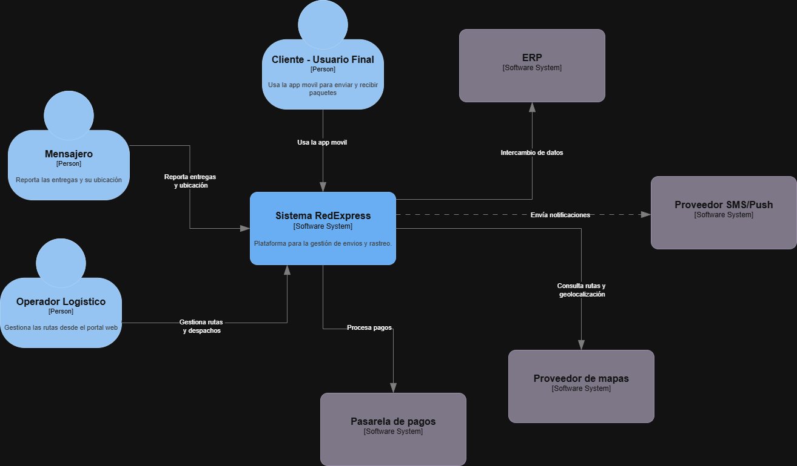
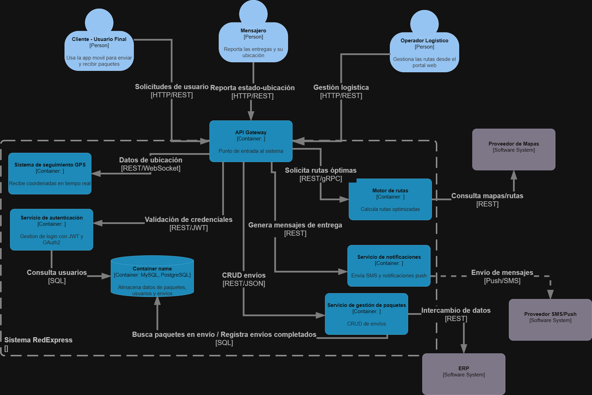

# 🗒️ Registro de Trabajo en Clase - Taller 3

## 📆 Fecha de la sesión
07/09/2025

## 👥 Integrantes presentes
- Mateo González Cano
- Santiago Sánchez Cárdenas

## 🧠 Actividades realizadas en clase

Se trabajó el caso de referencia RedExpress como práctica para aplicar el modelo C4:

- Se discutieron los actores principales del sistema: Cliente Usuario Final, Mensajero y Operador Logístico.
- Se identificaron los sistemas externos que interactúan con RedExpress: ERP, Proveedor de Mapas, Proveedor SMS/Push y Pasarela de Pagos.
- Se modeló la Vista de Contexto (C1) mostrando cómo interactúan los actores y los sistemas externos.
- Se bocetó la Vista de Contenedores (C2) incluyendo los contenedores principales: API Gateway, Servicio de autenticación, Servicio de gestión de paquetes, Sistema de seguimiento GPS, Motor de rutas, Servicio de notificaciones y Base de datos.
- Se utilizó draw.io como herramienta principal para diagramar.

## 🧩 Boceto inicial del modelo

- **C1 (Contexto):** actores externos y el sistema RedExpress como caja negra.
  
- **C2 (Contenedores):** servicios internos que conforman el sistema y su comunicación con sistemas externos.
  

> (Los diagramas preliminares se encuentran en los archivos `c1-contexto-caso.png` y `c2-contenedores-caso.png` dentro de esta carpeta.)

## 🔁 Tareas definidas para complementar el taller

| Tarea asignada              | Responsable       | Fecha estimada |
|------------------------------|------------------|----------------|
| Revisar y limpiar diagramas | Santiago Sánchez            | 09/09/2025     |
| Preparar informe del caso real | Mateo Gonzalez | 12/09/2025     |

---

_Este documento resume el trabajo colaborativo realizado durante la sesión del Taller 3 (caso RedExpress) en el curso AREM - Universidad de La Sabana._