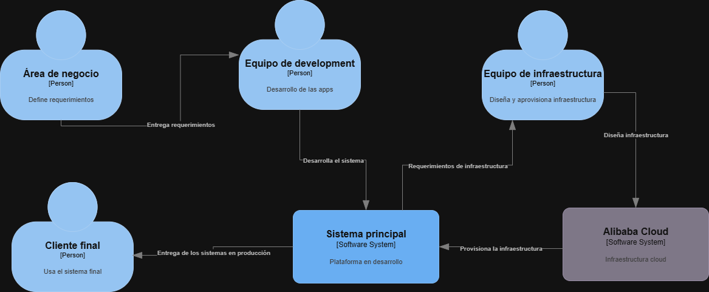
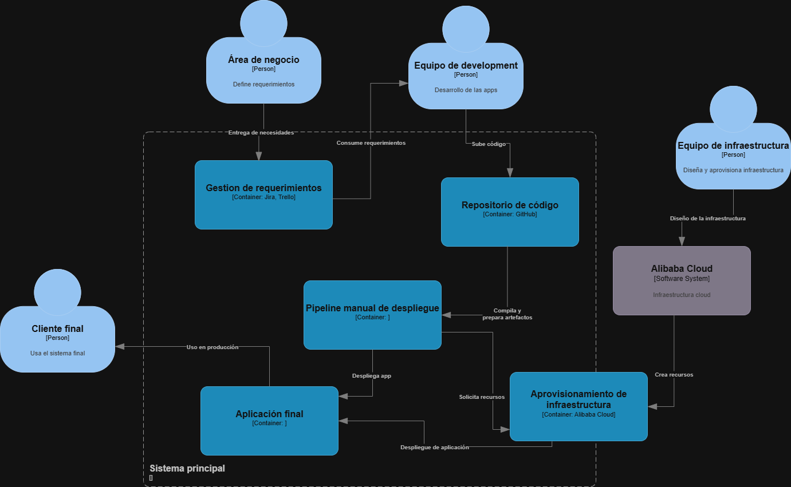

# 📄 Informe Técnico del Taller

## 🔖 Nombre del Taller
_Taller 3 Arquitectura Actual del Sistema con el Modelo C4_

## 👥 Integrantes del equipo
- Mateo González Cano
- Santiago Sánchez Cárdenas

## 🧠 Descripción general del trabajo
El objetivo de este taller fue modelar la arquitectura de **Macondo Magic Softwares** mediante las vistas C1 (Contexto) y C2 (Contenedores) del modelo C4.  
La intención era representar cómo interactúan los actores internos y externos con el sistema principal, así como visualizar los componentes que lo conforman y las relaciones entre ellos.  

La actividad se desarrolló con base en la documentación previa del taller de identificación de procesos de aprovisionamiento en la nube. De allí se extrajeron los actores principales, los flujos de aprovisionamiento en Alibaba Cloud y las limitaciones actuales.  

## 🔧 Proceso de desarrollo
El trabajo se realizó en tres fases:  

1. **Revisión del AS-IS previo**: Se analizaron los diagramas de actividades entregados en el taller anterior para identificar actores y procesos relevantes.  
2. **Modelado del C1 (Contexto)**: Se definieron los actores clave (área de negocio, equipo de development, equipo de infraestructura y cliente final) y se representó el sistema principal junto con su relación con Alibaba Cloud como sistema externo.  
3. **Modelado del C2 (Contenedores)**: Se descompuso el sistema principal en sus componentes internos: gestión de requerimientos, repositorio de código, pipeline manual de despliegue, aprovisionamiento de infraestructura, aplicación final y base de datos en la nube.  

Las herramientas utilizadas fueron draw.io para diagramación y la notación de C4, manteniendo las convenciones de flechas con descripciones claras.  

## 🧩 Análisis del modelo propuesto
- **Estructura del modelo**:  
  El modelo C1 muestra cómo los actores internos (negocio, dev, infraestructura) se relacionan con el sistema principal y cómo este se apoya en Alibaba Cloud para ejecutar despliegues.  
  El C2 detalla los contenedores que soportan el flujo actual: desde la gestión de requerimientos hasta la entrega de superapps a clientes finales, pasando por repositorios, pipeline manual y aprovisionamiento.  

- **Representación de necesidades del cliente**:  
  Los diagramas reflejan los problemas actuales de Macondo: procesos manuales de despliegue, dependencia directa de la infraestructura cloud sin automatización avanzada, y la necesidad de escalar a múltiples países con eficiencia.  

- **Supuestos tomados**:  
  - Se asumió que la gestión de requerimientos se realiza en herramientas tipo Jira/Trello, aunque no fue especificado.  
  - Se asumió el uso de un repositorio de código basado en Git (ej. GitHub), como práctica estándar de la industria.  
  - Se representó el pipeline como manual, reflejando la ausencia de CI/CD automático según lo descrito en el AS-IS.  
  - La base de datos se modeló como parte de Alibaba Cloud, dado que el informe menciona despliegues en esa nube.  

## 📈 Diagramas finales entregados
- **C1 (Contexto):**  
  
[📄 Versión PDF](./c1-contexto-Macondo.pdf)

- **C2 (Contenedores):**  
 
[📄 Versión PDF](./c2-contenedores-Macondo.pdf) 

## 📋 Tabla de actores, entidades o componentes

| Nombre del elemento              | Tipo          | Descripción                                               | Responsable              |
|----------------------------------|---------------|-----------------------------------------------------------|--------------------------|
| Área de negocio                  | Actor         | Define y prioriza requerimientos de software              | Equipo de negocio        |
| Equipo de development            | Actor         | Desarrolla aplicaciones y sube código a repositorios      | Dev Team                 |
| Equipo de infraestructura        | Actor         | Diseña y aprovisiona infraestructura en Alibaba Cloud     | Infra Team               |
| Cliente final                    | Actor         | Usuario que consume la aplicación en producción           | Usuarios externos        |
| Gestión de requerimientos        | Contenedor    | Backlog de tareas y requerimientos (ej. Jira, Trello)     | Negocio + Dev Team       |
| Repositorio de código            | Contenedor    | Almacén de código fuente (ej. GitHub)                     | Dev Team                 |
| Pipeline manual de despliegue    | Contenedor    | Scripts y pasos manuales para generar entregables         | Dev + Infra Team         |
| Aprovisionamiento de infraestructura | Contenedor | Interfaz con Alibaba Cloud para crear recursos            | Infra Team               |
| Aplicación final                 | Contenedor    | Superapp entregada a clientes en producción               | Dev Team                 |
| Alibaba Cloud                    | Sistema externo | Proveedor de servicios cloud (VMs, BD, balanceador)     | Infra Team / Alibaba     |

## 🔍 Investigación complementaria
### Tema investigado:
Uso del modelo C4 en la industria y su aplicación en arquitecturas en la nube.  

### Resumen:
El modelo C4 se ha convertido en un estándar ligero y práctico para comunicar arquitecturas de software. A diferencia de enfoques como TOGAF, su propósito es principalmente visual y descriptivo, facilitando la comunicación entre perfiles técnicos y de negocio.  

En entornos cloud, aplicar C4 ayuda a distinguir claramente entre actores, sistemas, contenedores y componentes, lo que permite detectar cuellos de botella (ejemplo: pipelines manuales), dependencias fuertes (ejemplo: un único proveedor como Alibaba Cloud) y oportunidades de mejora (ejemplo: introducir IaC o CI/CD).  

Además, buenas prácticas en el uso de C4 recomiendan **no sobrecargar los diagramas** con detalles de implementación, sino mantenerlos legibles y complementarlos con documentación técnica (ej. catálogos de APIs, contratos OpenAPI).  

Esto se relaciona con el taller porque permitió a nuestro equipo representar el estado actual de Macondo Magic Softwares y poder preparar requerimientos para un futuro modelo TO-BE donde se reduzca la dependencia manual y se mejoren escalabilidad y control de costos para lograr los objetivos de negocio que nos expresaron.  

## 📚 Referencias
- [1] Brown, Simon. *The C4 model for visualising software architecture*. 2020. https://c4model.com/  
- [2] Object Management Group (OMG). *Unified Modeling Language (UML) 2.5.1 Specification*. 2017. https://www.omg.org/spec/UML/2.5.1/  
- [3] HashiCorp. *Infrastructure as Code: Best Practices*. 2022. https://developer.hashicorp.com/  
- [4] Open Group. *TOGAF Standard, Version 9.2*. 2018. https://pubs.opengroup.org/architecture/togaf9-doc/  

---

_Este documento hace parte de la entrega del curso AREM (Arquitectura Empresarial) - Universidad de La Sabana._